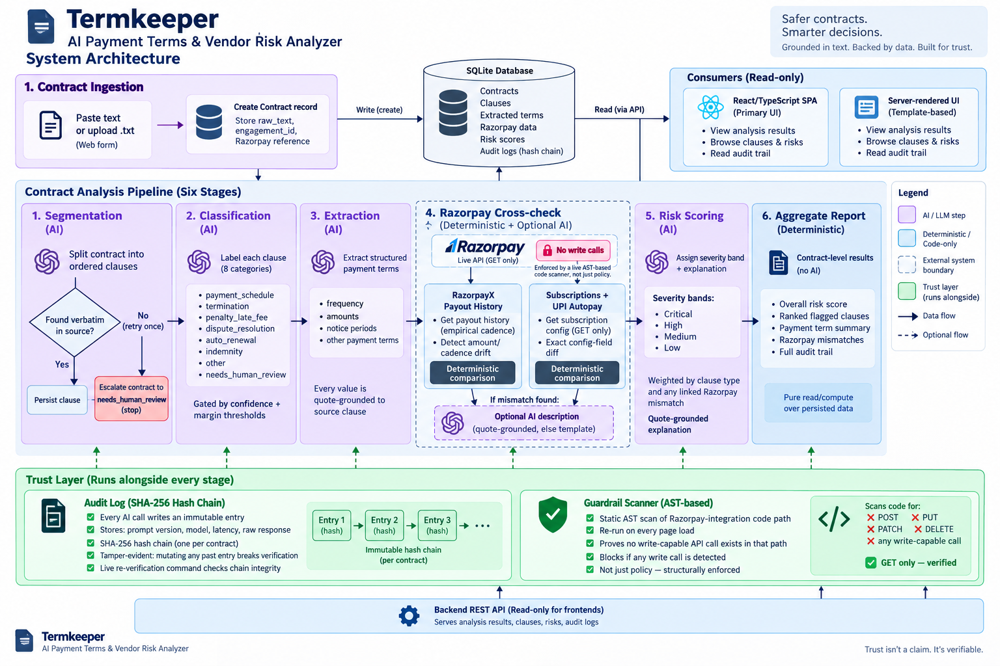

# AI Payment Terms & Vendor Risk Analyzer

Built for the **Razorpay AI Buildathon (Open Track)**.

It reads a freelance/vendor contract, extracts what it actually promises about
money — payout cadence, amounts, penalties, termination notice — and then
does the part a plain contract-analysis tool can't: it **cross-checks those
terms against real Razorpay data** for the same engagement (RazorpayX Payout
history, or Subscriptions/UPI Autopay config) and flags where the contract's
words and the platform's behavior disagree. The output is a clause-by-clause
risk report with a plain-English, quote-grounded explanation for every flag.

For the full buildathon narrative (problem, why-now, scoring rationale), see
**[`PITCH.md`](PITCH.md)**. For the complete decision history behind every
capability in this codebase, see **[`openspec/changes/`](openspec/changes/)**
— nothing here was built without a proposal and a spec written first (details
below, under [Spec-driven development](#spec-driven-development)).



See **[`ARCHITECTURE.md`](ARCHITECTURE.md)** for the same six stages walked
through in detail, with exact function names and file paths.

## The core differentiator

Most "contract risk" tools stop at reading the clause text. This one goes one
step further: for a payment-schedule or penalty clause, it checks what
**actually happened on the payment rail**, via two paths chosen for what
Razorpay genuinely exposes:

| Path | What's checked | Why this path |
|---|---|---|
| **RazorpayX Payouts** | Empirical cadence/amount, derived from the timestamps and amounts of real Payout records | RazorpayX exposes no "schedule config" API — history is the only honest ground truth |
| **Subscriptions / UPI Autopay** | Exact config field diff (period, interval, per-cycle amount cap, expiry) against the contract | These fields are real, independently GET-able mandate config — an exact diff, not an inference |

A clause is never marked "verified" or "mismatched" without one of these two
real, checkable comparisons behind it.

## Pipeline

Six stages, each a small, tested service function:

1. **Clause segmentation** — split contract text into individually addressable, verbatim clauses (`pipeline`)
2. **Clause classification** — tag each clause against an 8-label taxonomy (`pipeline`)
3. **Payment-term extraction** — pull concrete terms: cadence, amounts, triggers, notice periods (`pipeline`)
4. **Razorpay cross-check** — the two paths above (`razorpay_integration`)
5. **Risk scoring** — severity + a plain-English, quote-grounded explanation per clause (`risk_scoring`)
6. **Aggregate report** — a pure-query rollup: overall score, top flags, mismatches (`reporting`)

## Guardrails (enforced by code, not just documented)

- **No live writes.** A live AST-based static scanner — viewable at `/guardrail` in both UIs — proves the Razorpay integration's production code path never issues a write (POST) call against real account data. The only write calls anywhere in the codebase are confined to isolated test-mode fixture/demo-seeding code.
- **No ungrounded explanations.** Every AI-generated risk explanation or mismatch description must quote its source clause verbatim before it's persisted. If that verification fails, the pipeline doesn't guess: a risk explanation falls back to `needs_human_review`, and a mismatch description falls back to a deterministic template.

## Tech stack

- **Backend:** Django + Django REST Framework, SQLite, OpenAI (Responses API, structured JSON-schema output) called through one shared wrapper, `core/llm_client.py` — every pipeline stage goes through it, nothing calls the OpenAI SDK directly.
- **Frontend:** React + TypeScript + Vite ("Termkeeper"), calling the backend over a CORS-enabled JSON API. Lives in [`frontend/`](frontend/) as a wholly separate project — its own `package.json`, its own dependency tree.
- **Second UI:** a simpler, server-rendered Django-templates report viewer in [`report_ui/`](report_ui/) (see [Two UIs](#two-uis-and-why-both-exist) below).
- **Dev tooling:** pytest + pytest-django + factory_boy (backend), Vitest + Testing Library (frontend), ruff + mypy (backend linting/typing).

## Repository structure

| Path | Purpose |
|---|---|
| [`config/`](config/) | Django project config: settings split into `base`/`local`/`production`, root URLConf, WSGI/ASGI entry points |
| [`core/`](core/) | Shared infrastructure — `llm_client.py`, the one OpenAI client wrapper every pipeline stage calls through |
| [`contracts/`](contracts/) | `Contract`/`Clause` models, ingestion service, the `ingest_contract` management command |
| [`pipeline/`](pipeline/) | Orchestrates stages 1–3 (segmentation, classification, extraction) and gates the stage-4 call into `razorpay_integration`; the `run_pipeline` command |
| [`razorpay_integration/`](razorpay_integration/) | `RazorpayConnector`, both cross-check paths, `PlatformRecord`/`MismatchFlag` models — the only app that talks to Razorpay |
| [`risk_scoring/`](risk_scoring/) | Stage 5: quote-grounded risk scoring, the `RiskAssessment` model |
| [`reporting/`](reporting/) | The one read-model app — every non-trivial read (aggregate report, reasoning chain, guardrail scan) lives here as selectors, consumed by both UIs and the JSON API |
| [`evaluation/`](evaluation/) | Deterministic synthetic-contract generator, held-out eval harness, precision/recall/severity-calibration and false-positive/false-negative cost reporting, the `eval` command |
| [`report_ui/`](report_ui/) | The original server-rendered Django-templates report viewer |
| [`frontend/`](frontend/) | The standalone React + TypeScript + Vite UI — its own README lives at [`frontend/README.md`](frontend/README.md) |
| [`openspec/`](openspec/) | Spec-driven development history: a proposal, spec, design doc, and task list for every change, written before the code that implements it |
| `templates/` | Empty, kept intentionally — see [note](#a-note-on-templates-and-static) below |
| [`PITCH.md`](PITCH.md) | The buildathon pitch/narrative, independently verified against this codebase |
| `manage.py`, `pyproject.toml`, `pytest.ini`, `.env.example` | Django entry point and project-level config |

### A note on `templates/` and `static/`

The repo shipped with two empty root-level directories left over from the
initial `django-admin startproject` scaffold. They were audited against
`config/settings/base.py` rather than assumed either way:

- **`templates/` is kept.** `TEMPLATES[0]["DIRS"]` in `base.py` explicitly
  points at `BASE_DIR / "templates"`. It's empty today because every actual
  template lives in `report_ui/templates/report_ui/` and is picked up via
  Django's per-app `APP_DIRS` loader instead — but the directory is a real,
  referenced setting, not dead scaffold, so it stays.
- **`static/` was removed.** Nothing in any settings file sets
  `STATICFILES_DIRS` — only `STATIC_URL` and `STATIC_ROOT` (the
  `collectstatic` output directory) are configured, and neither points here.
  `report_ui/static/report_ui/` is the only static-asset directory the
  project actually uses. The root `static/` was unreferenced, empty, and has
  been deleted.

## Two UIs, and why both exist

There are two working front ends against the same backend:

- **`report_ui`** (Django templates, served at `/report/...` on the Django
  dev server) — built first, and still the reference implementation of what
  the reasoning chain, audit log, and guardrail views should show.
- **`frontend`** (React + TypeScript + Vite, its own dev server on `:5173`)
  — added later, once the project owner explicitly asked for a genuinely
  separate frontend/backend split rather than a Django-only app.

This is a recorded decision, not an oversight: `report_ui`'s original design
chose Django templates specifically *to avoid* a second project, and adding
`frontend` later reversed that call. Rather than silently retiring the older
UI once a newer one existed, the reversal — and the reasoning for keeping
`report_ui` rather than deleting already-built, already-tested work — is
written down as an ADR in
[`openspec/changes/add-react-frontend/design.md`](openspec/changes/add-react-frontend/design.md)
(see "Decisions"). Both UIs are exercised by their own test suites and are
expected to keep passing.

## Running locally

You need two servers running side by side: the Django backend (`:8000`) and
the Vite dev server (`:5173`).

### Backend

```bash
# from the repo root
python -m venv .venv

# Windows
.venv\Scripts\activate
# macOS / Linux
source .venv/bin/activate

# Dependencies are declared in pyproject.toml, but the project has no
# [build-system] table, so `pip install -e .` will fail (multiple
# top-level packages discovered) — install them directly instead:
pip install django djangorestframework openai python-dotenv razorpay django-cors-headers

# only needed for running tests/lint/type-checks:
pip install pytest pytest-django factory_boy ruff mypy django-stubs

cp .env.example .env
# then edit .env — at minimum set OPENAI_API_KEY; every other variable has
# a working default (see the comments in .env.example)

python manage.py migrate
python manage.py runserver        # http://localhost:8000
```

### Frontend

```bash
cd frontend
npm install
cp .env.example .env.local        # adjust VITE_API_BASE_URL if the backend isn't on :8000
npm run dev                       # http://localhost:5173
```

The frontend calls the backend exclusively over HTTP — it has zero shared
build tooling or dependencies with the Django project. See
[`frontend/README.md`](frontend/README.md) for its own layout and build/test
commands.

## Testing

```bash
# backend — from the repo root
python -m pytest -q

# frontend — from frontend/
npm run test
```

As of this writing (verified live, not carried over from an earlier run):

- **Backend:** `460 passed` (pytest, `python manage.py check` also reports
  no issues)
- **Frontend:** `70 passed` across 11 test files (Vitest)

Run the commands above yourself for the current numbers — they will drift
as the codebase grows past this point.

## Spec-driven development

Every capability in this codebase was built through
[OpenSpec](openspec/config.yaml): a **proposal** (why, what changes,
non-goals), a **spec** (testable `SHALL` requirements with scenarios), a
**design doc** (ADRs, models, service/selector signatures), and a **task
list** — all written and reviewed *before* the corresponding code. The full
history, in build order, lives in `openspec/changes/`:

| Change | What it added |
|---|---|
| `add-django-foundation` | Project skeleton, `Contract`/`Clause`/`ExtractedTerm` models, pipeline stages 1–3 |
| `add-razorpay-crosscheck` | `razorpay_integration` app, both cross-check paths, pipeline stage 4 |
| `add-risk-scoring-report` | Risk scoring (stage 5), the aggregate report (stage 6), report endpoints/CLI |
| `add-evaluation-harness` | The synthetic-dataset generator and the precision/recall/cost-report eval harness |
| `add-report-ui` | The server-rendered Django-templates report viewer, incl. the guardrail-verification view |
| `switch-llm-provider-to-openai` | Swapped the LLM provider from Claude to OpenAI's Responses API — a pure implementation change, no pipeline behavior changed |
| `add-react-frontend` | The standalone React/TypeScript/Vite UI and the JSON API it calls; the ADR for keeping `report_ui` |
| `close-pitch-accuracy-gaps` | Closed two pitch-vs-code accuracy gaps: per-clause-type severity breakdown in the report, a committed synthetic-dataset snapshot |
| `add-confirmed-platform-evidence` | Gave both UIs a distinct "confirmed — matches platform data" state, instead of collapsing a verified match into "no evidence available" |

Nothing above is invented for this README — each row is a live directory
under `openspec/changes/` with its own `proposal.md`/`design.md`/`tasks.md`
(and, for all but one, a `specs/` delta). Read any of them for the actual
reasoning behind a decision rather than taking this table's summary as
final.
